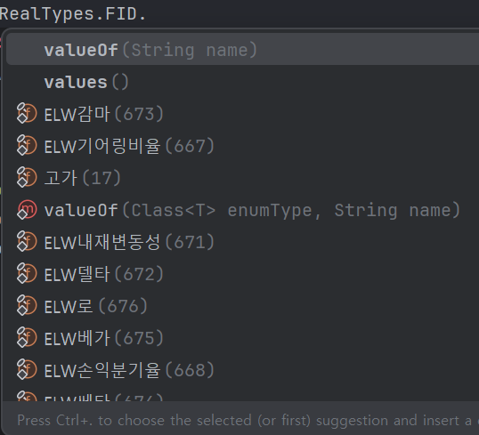

# Koava
Koava는 키움증권의 Open API를 Java에서 사용할 수 있도록 도와주는 라이브러리입니다.  
smok95님의 [kw_](https://github.com/smok95/kw_) 프로젝트의 dll 을 기반으로 작동합니다.  
성능과 개발 편의성 둘 다 고려하다보니 코드가 엉망인 부분이 있습니다. 개선할 수 있는 아이디어 필요합니다!

## 실행 요구 사항
- ``java 8 (32bit)``  
- ``키움증권 Open API``  
키움증권의 Open API가 32비트를 요구합니다. 때문에 **자바8 (32비트)** 만을 지원합니다.

## 주의 사항
**아직 충분한 테스트가 이루어지지 않았습니다. 꼭 모의 투자 모드로 로그인 하셔서 충분한 테스트를 진행해보시기를 바랍니다.**  

## 키움증권 Open api 사용법
- https://github.com/me2nuk/stockOpenAPI?tab=readme-ov-file
- [kw_ 리포지토리](https://github.com/smok95/kw_)
- https://download.kiwoom.com/web/openapi/kiwoom_openapi_plus_devguide_ver_1.5.pdf

## 사용 방법 (예시 코드)

### 기본 준비
이 리포지토리를 IDE에서 열고 maven install해주세요. 
이후, pom.xml의 의존성 목록에 아래와 같이 추가하시면 됩니다.
```xml
        <dependency>
            <groupId>me.jungwuk.koava</groupId>
            <artifactId>koava</artifactId>
            <version>1.0-SNAPSHOT</version>
        </dependency>
```

### 코드 작성, Koava 사용 준비
```java
Koava k = Koava.getInstance();
k.init(); // 초기화
```

### 로그인 이벤트 콜백(핸들러) 설정
```java
k.setOnEventConnect(errCode -> {
    KoaCode code = KoaCode.fromCode(errCode);

    if (!code.isError()) {
        System.out.println("로그인 성공");
    } else {
        System.out.println("오류 발생 : " + code.getErrorMessage());
        System.out.println(errCode);
        k.disconnect();
    }
});
```

### 로그인 창 실행
키움 증권 Open API를 실행하여 로그인 창을 표시합니다.
```java
KoaCode code = k.commConnect();
if (code.isError()) {
    System.out.println("로그인 창을 열지 못했습니다! " + code.getErrorMessage());
    Runtime.getRuntime().exit(1);
}
```

### 접속 종료 대기
``k.disconnect();``가 실행될 때까지 대기합니다. 
```java
k.waitDisconnection();
```

## 특징
### 이벤트 핸들러
하나의 이벤트에 여러 콜백(핸들러)를 붙일 수 있습니다.
```java
 // 여러개의 이벤트 핸들러 등록 가능
        k.addEventHandler(new MyEventHandler());
        k.addEventHandler(new MyEventHandler2(k));
```

핸들러는 아래와 같은 모습을 가지고 있습니다.  

```java
package me.jungwuk.koava.example.handlers;

import me.jungwuk.koava.Koava;
import me.jungwuk.koava.callbacks.KoaEventHandler;
import me.jungwuk.koava.enums.RealTypes;

public class MyEventHandler2 extends KoaEventHandler {
    final Koava koava;

    public MyEventHandler2(Koava koava) {
        this.koava = koava;
    }

    @Override
    public void onEventConnect(int errCode) {
        System.out.println("핸들러 2에서 로그인 이벤트를 받음");
    }

    @Override
    public void onReceiveRealData(String realKey, String realType, String realData) {
        if (realType.equals("주식체결")) {
            System.out.println("종목 코드 : " + realKey);
            System.out.println("데이터 : " + realData);

            RealTypes.FID fid = RealTypes.주식체결.현재가;
            System.out.println("현재가 : " + koava.getCommRealData(realKey, fid));
            // koava.getCommRealData(realKey, 10);으로도 가져올 수 있어요
        }
    }

    @Override
    public void onReceiveMsg(String scrNo, String rqName, String trCode, String msg) {
        System.out.println("받은 메시지 : " + msg);
    }
}
```

### KW_ 라이브러리 직접 사용
Koava 초기화 후, ``getKw()`` 메소드 호출로 KwLibrary 인스턴스를 받을 수 있습니다.  
이렇게 하면 더욱 직접적으로 KW_ 라이브러리와 통신하여 성능을 높일 수 있습니다.  

단, 포인터를 직접 free해주셔야 합니다. 그렇지 않으면 메모리 누수가 발생할 수 있습니다.  
```java
Koava k = Koava.getInstance();
// 초기화
k.init();

KwLibrary lib = k.getKw();
lib.kw_GetLoginInfoW(WString)
```

### 편리한 개발
FID는 한글로 가져올 수 있습니다.  

```java
RealTypes.FID.현재가 // enum FID는 모든 FID를 가지고 있습니다.
```  
  
RealTypes는 KOA Studio에서 확인할 수 있는 실시간 타입들이 있습니다. 해당 타입에서 사용할 수 있는 FID를 정리해두었습니다.
```java
RealTypes.주식체결.현재가 // 실시간 타입에 맞는 FID
```  
물론, 한글 사용이 불편하신 분들은 이렇게도 FID를 가져올 수 있습니다.  
```java
RealTypes.getFidByNum(20);
```  
그리고, FID를 인자로 받는 모든 API 메소드는 int값도 허용합니다.  
```java
RealTypes.FID fid = RealTypes.FID.현재가;
koava.getCommRealData(realKey, fid);

// 또는
koava.getCommRealData(realKey, 10);
```

### FID 값 받아오기  

getCommRealData를 호출해도 되지만, 이런 쉬운 방법도 있습니다.
```java
RealTypes.주식체결.현재가.get();
// 또는
RealTypes.FID.현재가.get();
// 또는
RealTypes.getFidByNum(10).get();
```

---
조금 더 편리하게 개발하실 수 있도록 메소드에 다양한 파라미터를 넣을 수 있도록 해두었습니다.  
```java
k.setRealReg("1000", "005930;000660", new RealTypes.FID[] {RealTypes.FID.현재가}, RealRegistOption.CLEAR);
// 위 코드는 아래 코드들과 동일합니다.
                
k.setRealReg("1000", "005930;000660", new RealTypes.FID[] {RealTypes.getFidByNum(10)}, RealRegistOption.CLEAR);

k.setRealReg("1000", "005930;000660", RealTypes.FID.현재가, RealRegistOption.CLEAR);
k.setRealReg("1000", "005930;000660", RealTypes.getFidByNum(10), RealRegistOption.CLEAR);

k.setRealReg("1000", "005930;000660", "10", RealRegistOption.CLEAR);

// 여러 fid를 String으로 넣는 방법
k.setRealReg("1000", "005930;000660", "10;20", RealRegistOption.CLEAR);
                 
```

## 더 많은 예제
[여기](./example/) 에서 확인해보세요.  
계속해서 추가하겠습니다.

## 기여
기여를 매우 환영합니다. 따로 규칙은 없으니 자유롭게 기여해주세요.  

## 질문
이슈에 남겨주시면 감사하겠습니다.